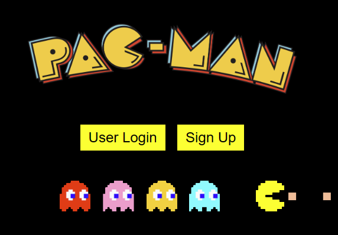
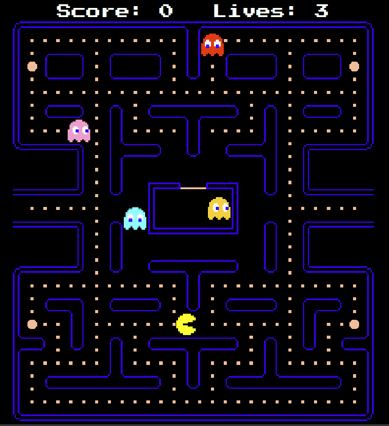

# 🎮 Pacman in Phaser.js

## Description
This is a Pacman clone created by James Hartley and Sebastian Hall as a group project for a college programming class. It uses the Phaser.js JavaScript game engine, PHP, and MySQL for the login system and high score list. The game features classic Pacman gameplay, with a high score database that allows players to compete for the highest score.

## Dependencies

Please check [Getting Started With Phaser](https://phaser.io/tutorials/getting-started-phaser3/index) since you need a local running webserver to run this project.

In addition to the Phaser Dependencies you will also need 

* PHP 5.0
* MySQL Database

## How to Run

Easiest way to just play the game is to upload the entire repo to a freebie web server and open game.php

If you want to host it locally I would recommend using [XAMPP](https://www.apachefriends.org/download.html)

## Ghost Logic/Movement Explanation

| Color (HEX)  | Name     | Personality | Notes |
|--------------|----------|------------|--------|
| Red (#FF0000)|Blinky|Chaser|Only one that starts outside of pen
| Pink (#FFC0CB)|Pinky|Ambusher
|Cyan (#00FFFF)|Inky|Fickle
|Orange (FFA500)|Clyde|Feign/Mislead

#### TLDR;
The tile that Pacman is on is what determines which direction the ghosts will go.

#### Blinky
Directly chases Pacman. Targets tile that Pacman is currently on.
As game progresses, speed increases to the point where blinky is marginally faster than Pacman
* Depends on the number of dots consumed by Pacman which decreases as game level increases
* Momentarily pauses speed when Pacman loses a life

#### Pinky 
Tries to land on space 4 tiles in front of Pac-Man (Ambush method)

#### Inky
Determined by both relative position of Pacman and Blinky (RED).
Take tile 2 spaces ahead of Pacman and double the distance Blinky is away from it. The end of the new vector should be the target tile.
Movement perceived as more erratic.

#### Clyde
Movement based on how far away he is from Pacman.
More than 8 tiles away from Pacman, movement identical to Blinky
When within 8 tiles of Pacman, attempt to flee to the bottom left portion of the screen and hide
